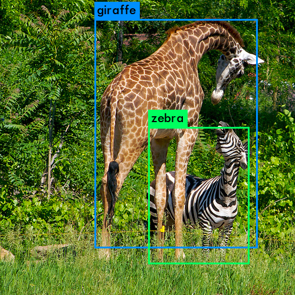

The repo makes yolov3 net more fast and simple on Android, Raspberry Pi, other lightweight devices.
The core' size limited to 200kb and you can modify and customize easily. 

The YOLOv3-tiny network can running with high FPS (22ms/52mAP), everything unrelated was dropped, including cuda computing, trainning period and some layers. 

### Demo1
Just try it by building C code and running yolov3 object detection demo. You can get a C struct containing object names, probability and bounding boxs' axis as API. It works if you got predicition images like this,

###  Restful Server Demo

~~~bash
#launch restful_server.py and testing rest api using curl 
#upload dog.jpg, and we got the detail of detection 
curl -X POST -F image=@dog.jpg 'http://localhost:5000/detect'
{
  "predictions:": [
    {
      "h": 56.46, 
      "label": "dog", 
      "prob": 73.18, 
      "w": 44.56, 
      "x": 47.93, 
      "y": 36.55
    }
  ]
}
~~~

###  Acknowledgement

Darknet is fantastic.

- Darknet official repo: [Convolutional Neural Networks ](https://github.com/pjreddie/darknet)
- YOLOv3: [Real-Time Object Detection](https://pjreddie.com/media/files/papers/YOLOv3.pdf)

